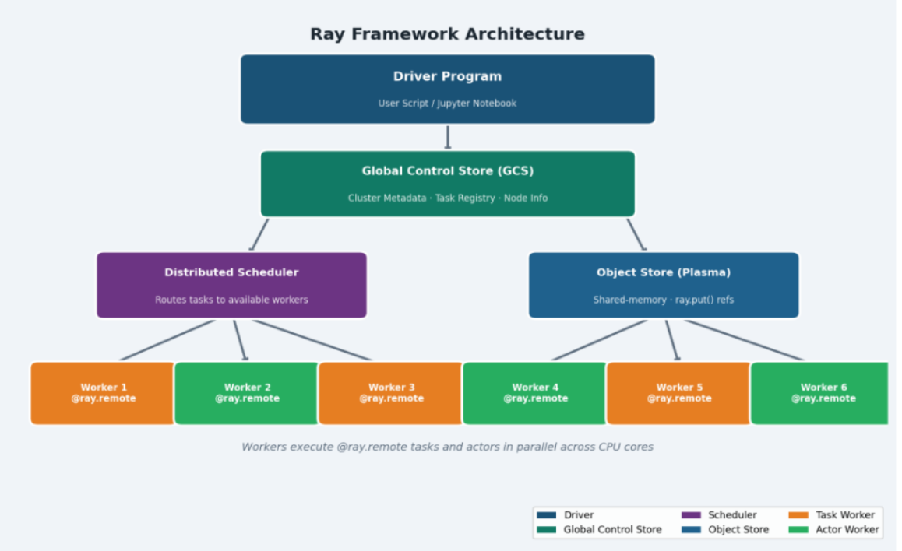
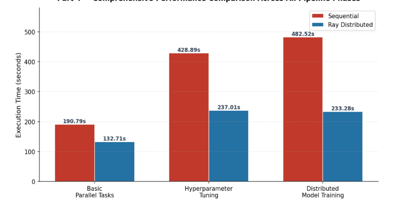

# Distributed Model Training for Azure VM Failure Prediction using Ray

A distributed machine learning project that predicts Azure Virtual Machine failures using Ray for parallel computing, benchmarked against traditional sequential execution across the full ML pipeline.

---

## Problem Statement

Cloud environments host thousands of virtual machines that continuously generate telemetry and operational data. Unexpected VM failures can result in service interruptions, performance degradation, and increased operational costs. Traditional machine learning workflows can become computationally expensive when processing large-scale cloud datasets. This project addresses the challenge by combining predictive analytics with distributed computing to efficiently train machine learning models capable of forecasting VM failures.

---

## Objective

- Predict Azure Virtual Machine failures using machine learning.
- Compare sequential and distributed execution performance.
- Reduce training time through parallel processing with Ray.
- Analyze performance improvements across different pipeline stages.

---

## About Ray

Ray is an open-source distributed computing framework for Python that makes it easy to parallelize and scale machine learning workloads. It provides a simple API for converting standard Python functions and classes into distributed tasks and actors that run across multiple CPU cores or nodes. In this project, Ray is used to parallelize model training, hyperparameter tuning, and distributed evaluation, significantly reducing execution time compared to sequential approaches.

---

## Technologies Used

- Python
- Ray
- Pandas
- NumPy
- scikit-learn
- Matplotlib
- Kaggle Notebooks

---

## Dataset

The project uses the Azure VM Failure Prediction dataset. The raw data was preprocessed, cleaned, and feature-engineered before training. Steps applied include handling missing values, feature selection, one-hot encoding of categorical variables, data transformation, and validation. The fully preprocessed dataset is available below and should be downloaded before running the notebook.

[Azure VM Failure Prediction Dataset: https://www.kaggle.com/datasets/rabbianoor07/azure-vm-data](https://www.kaggle.com/datasets/rabbianoor07/azure-vm-data)

---

## System Architecture



The system is built around Ray's distributed execution model, which consists of a driver program, a Global Control Store (GCS), a distributed scheduler, an object store (Plasma), and worker nodes that execute tasks in parallel across available CPU cores.

---

## Pipeline

### Part 1 — Basic Parallel Tasks

Multiple model training tasks are dispatched simultaneously as Ray remote functions, replacing a sequential training loop.

### Part 2 — Distributed Hyperparameter Tuning

All 16 hyperparameter combinations are evaluated in parallel using Ray remote tasks, replacing a traditional sequential grid-search loop.

### Part 3 — Distributed Model Training and Evaluation

Ray Actors are used to maintain stateful distributed training across five model configurations, enabling parallel execution with per-model timing and accuracy tracking.

### Part 4 — Performance Comparison and Final Analysis

Results from all parts are aggregated and visualized, covering total execution time, speedup factor, accuracy comparison, and total time saved by using Ray.

---

## Results



The distributed implementation achieved substantial reductions in execution time compared to sequential processing. Using Ray with Kaggle's multi-core environment enabled efficient utilization of available computational resources, resulting in faster model training and improved scalability.

---

## Installation and Setup

Clone the repository:

```bash
git clone https://github.com/Rabbia-Noor/distributed-ml-ray-project.git
cd distributed-ml-ray-project
```


## How to Run

Download the preprocessed Azure VM Failure Prediction dataset from this repository and place it in the project directory before running the notebook.

If running locally, launch the notebook with:

```bash
jupyter notebook notebooks/distributed_ml_ray_project.ipynb
```

If running on Kaggle, upload the notebook and dataset, enable internet access under Notebook Settings, then run all cells sequentially.

---

## Future Enhancements

- Ray Tune integration for advanced hyperparameter optimization
- Real-time Azure VM failure prediction
- Cloud deployment using Azure services
- Distributed inference pipelines
- Advanced ensemble learning models

---

## Conclusion

This project demonstrates the practical benefits of distributed computing for Azure VM failure prediction. By leveraging Ray's parallel execution model across Kaggle's multi-core environment, the pipeline achieves significant reductions in training time while maintaining prediction accuracy, making it a scalable approach for real-world cloud analytics workloads.

## Author
[Rabbia Noor](https://github.com/Rabbia-Noor)
